# ⚡ Job Application Hub
### *Where Careers Meet Innovation* ✨

<div align="center">


**🎯 A revolutionary full-stack platform that transforms the hiring landscape**

</div>

---

## 🌟 **The Vision**

Welcome to the future of job applications! This isn't just another job board—it's a **fully animated, interactive ecosystem** where job seekers discover their dream careers and employers find their perfect candidates. Built with modern web technologies and designed for the next generation of professionals.

<table>
<tr>
<td width="50%">

### 🚀 **For Job Seekers**
- **Smart Job Discovery** with AI-powered recommendations
- **One-Click Applications** with resume auto-fill
- **Real-time Tracking** of application status
- **Interactive Portfolio** showcase

</td>
<td width="50%">

### 💼 **For Employers**
- **Visual Candidate Pipeline** management
- **Automated Screening** tools
- **Team Collaboration** features
- **Analytics Dashboard** with insights

</td>
</tr>
</table>

---

## ✨ **Core Features**

```mermaid
graph LR
    A[🔍 Job Search] --> B[📝 Application]
    B --> C[📊 Tracking]
    C --> D[💬 Interview]
    D --> E[🎉 Hired]
    
    F[📢 Job Posting] --> G[👥 Candidate Review]
    G --> H[⭐ Selection]
    H --> D
```



### 🎨 **User Experience**
- **Micro-animations** powered by GSAP for buttery smooth interactions
- **Responsive design** that adapts beautifully to any screen
- **Dark/Light mode** toggle for personalized experience
- **Progressive Web App** capabilities for mobile excellence

### 🔐 **Security & Performance**
- **JWT Authentication** with refresh tokens
- **Rate limiting** and CORS protection
- **Lazy loading** for optimal performance
- **Real-time notifications** via WebSocket

---

## 🏗️ **Architecture**

```
🏢 Job-Application-Website/
│
├── 🎨 client/                    # Frontend Magic
│   ├── 📱 components/            # Reusable UI components
│   ├── 🎭 animations/            # GSAP animation configs
│   ├── 🎨 styles/               # CSS modules & themes
│   └── 📄 pages/                # Application routes
│
├── ⚙️  server/                   # Backend Engine
│   ├── 🔐 auth/                 # Authentication logic
│   ├── 📊 models/               # Database schemas
│   ├── 🛣️  routes/               # API endpoints
│   └── 🔧 middleware/           # Custom middleware
│
├── 📦 package.json              # Project configuration
└── 🌍 .env.example             # Environment template
```

---

## 🛠️ **Tech Stack**

<div align="center">

| Frontend | Backend | Database | Tools |
|----------|---------|----------|-------|
|  |  |  |  |
|  |  |  |  |
|  |  | |  |
|  | | | |

</div>

---

## 🚀 **Quick Start**

### Prerequisites
```bash
node >= 16.0.0
npm >= 8.0.0
```

### Installation

1. **Clone & Navigate**
   ```bash
   git clone https://github.com/khuramshahz/Job-Application-wesbite.git
   cd Job-Application-wesbite
   ```

2. **Install Dependencies**
   ```bash
   npm run install-all  # Installs both client and server deps
   ```

3. **Environment Setup**
   ```bash
   cp .env.example .env
   # Edit .env with your configuration
   ```

4. **Launch Development Server**
   ```bash
   npm run dev  # Starts both frontend and backend
   ```

🎉 **Your app will be live at `http://localhost:3000`**

---

## 📖 **Usage Guide**

### 👤 **As a Job Seeker**

```bash
1. 📝 Create Profile → 2. 🔍 Search Jobs → 3. 📤 Apply → 4. 📊 Track Progress
```

### 🏢 **As an Employer**

```bash
1. 🏗️  Setup Company → 2. 📢 Post Jobs → 3. 👥 Review Candidates → 4. 💬 Connect
```

---

## 🤝 **Contributing**

We welcome contributions! Please see our [Contributing Guide](CONTRIBUTING.md) for details.

<div align="center">

### 🌟 **Join the Community**

[](https://github.com/khuramshahz/Job-Application-wesbite/graphs/contributors)
[](https://github.com/khuramshahz/Job-Application-wesbite/stargazers)
[](https://github.com/khuramshahz/Job-Application-wesbite/network/members)

</div>

### 🔄 **Development Workflow**

```bash
# Create feature branch
git checkout -b feature/amazing-feature

# Make your changes
git add .
git commit -m "✨ Add amazing feature"

# Push and create PR
git push origin feature/amazing-feature
```

---

## 📊 **Project Stats**

<div align="center">

</div>

---

## 📄 **License**

This project is licensed under the MIT License - see the [LICENSE](LICENSE) file for details.

---

## 🤲 **Support**

<div align="center">

**Found this helpful? Give it a ⭐!**

[](https://github.com/khuramshahz)
[](mailto:your-email@example.com)

---

*"Connecting talent with opportunity, one click at a time"* 🚀

**Made with 💖 by [Khuram Shahzad](https://github.com/khuramshahz)**

</div>
